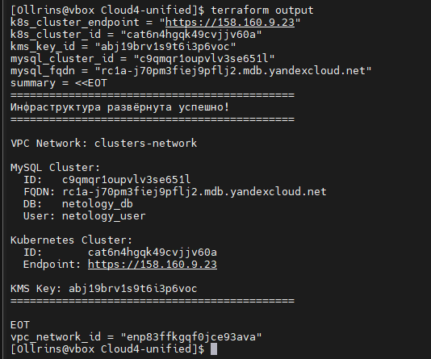
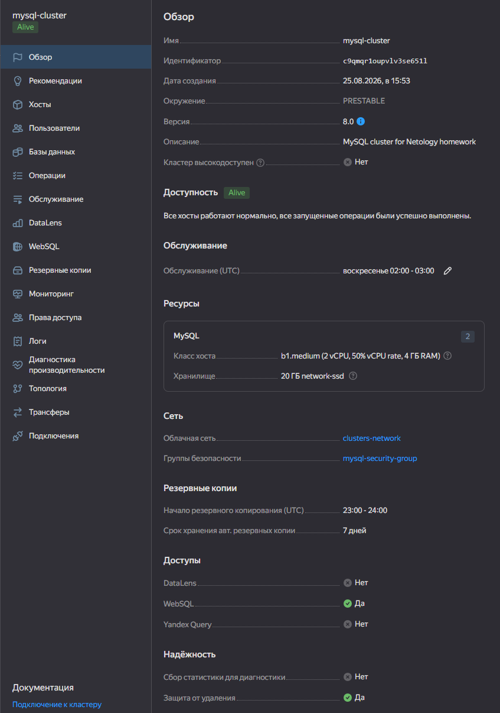
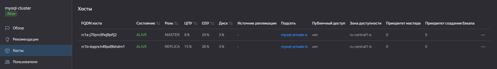
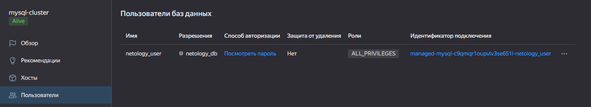
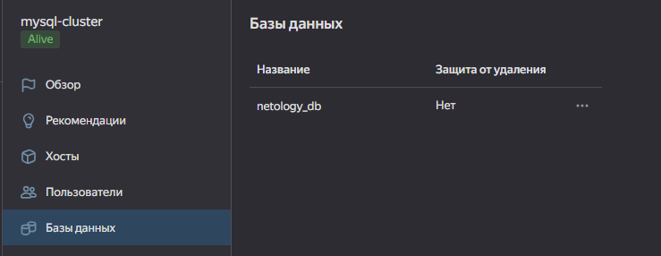
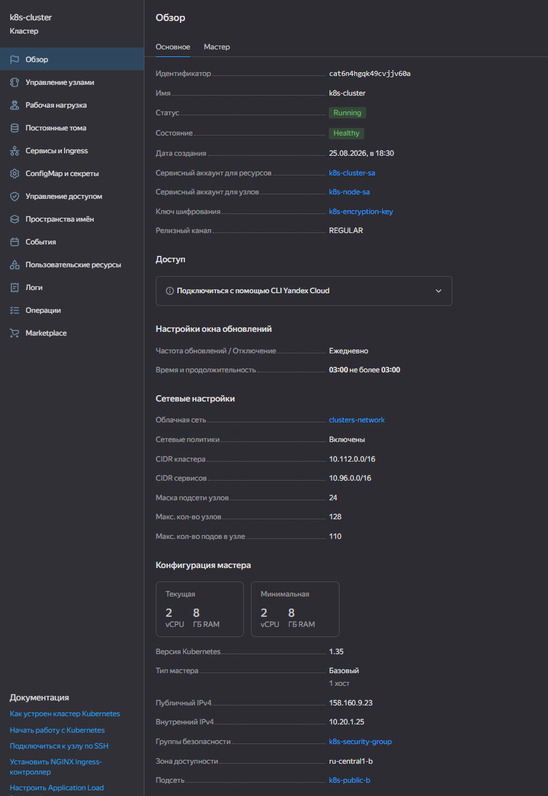
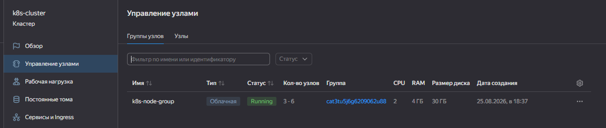

## Домашнее задание к занятию «Кластеры. Ресурсы под управлением облачных провайдеров»

## Часть 1. Кластер MySQL с отказоустойчивой архитектурой

### Файлы манифестов
- [providers.tf](providers.tf)
- [variables.tf](variables.tf)
- [vpc.tf](vpc.tf)
- [mysql.tf](mysql.tf)
- [outputs.tf](outputs.tf)

### Описание действий

**1. Создание VPC и подсетей:**
- Создана облачная сеть `mysql-network`
- Созданы 3 private подсети в разных зонах доступности для отказоустойчивости:
  - `mysql-private-a` (ru-central1-a, 10.10.0.0/24)
  - `mysql-private-b` (ru-central1-b, 10.10.1.0/24)
  - `mysql-private-d` (ru-central1-d, 10.10.2.0/24)
- Настроена группа безопасности `mysql-security-group` с правилами доступа

**2. Создание кластера MySQL:**
- Создан кластер `mysql-cluster` в окружении PRESTABLE
- Платформа: Intel Broadwell (b1.medium), 50% гарантированной доли vCPU
- Размер диска: 20 ГБ (network-ssd)
- Версия MySQL: 8.0
- Включена репликация с размещением хостов в разных зонах (ru-central1-a и ru-central1-b)
- Настроено время технического обслуживания: еженедельно, воскресенье в 03:00
- Время начала резервного копирования: 23:59
- Включена защита от непреднамеренного удаления (deletion_protection = true)

**3. Создание базы данных и пользователя:**
- Создана база данных `netology_db`
- Создан пользователь `netology_user` с полными правами на базу

### Выполнение и проверка

    <em>Рисунок 1 - Результат выполнения terraform apply: успешное создание всех ресурсов</em> 

    <em>Рисунок 2 - Основные настройки кластера MySQL: окружение PRESTABLE, класс хоста b1.medium (Intel Broadwell, 50% CPU), размер диска 20 ГБ, защита от удаления включена</em> 

    <em>Рисунок 3 - Отказоустойчивость: хосты кластера размещены в разных зонах доступности (ru-central1-a и ru-central1-b)</em> 

    <em>Рисунок 4 - Настройки резервного копирования и технического обслуживания: бэкап в 23:59, ТО еженедельно в воскресенье в 03:00</em> 

    <em>Рисунок 5 - Созданные объекты: база данных netology_db и пользователь netology_user с полными правами</em> 

## Часть 2. Кластер Kubernetes и микросервис phpMyAdmin

### Файлы манифестов
- [providers.tf](providers.tf)
- [variables.tf](variables.tf)
- [personal.auto.tfvars](personal.auto.tfvars)
- [vpc.tf](vpc.tf)
- [kms.tf](kms.tf)
- [k8s.tf](k8s.tf)
- [outputs.tf](outputs.tf)
- [phpmyadmin.yaml](phpmyadmin.yaml)

### Описание действий

**1. Создание единой VPC и подсетей:**
- Создана единая облачная сеть `clusters-network` для размещения как кластера MySQL, так и Kubernetes
- Мастер кластера и группа узлов размещены в зоне `ru-central1-b` с использованием подсети `k8s-public-b` (ограничение Yandex Cloud: автомасштабируемая группа узлов поддерживает только одну зону доступности)
- Настроена группа безопасности `k8s-security-group` с правилами:
  - Входящий трафик на порты 443 (HTTPS API), 80 (HTTP), 22 (SSH), 30000-32767 (NodePort)
  - Входящий трафик на порт 10250 (kubelet API) для работы `kubectl port-forward`, `exec`, `logs`
  - Исходящий трафик разрешён без ограничений

**2. Создание KMS-ключа для шифрования секретов:**
- Создан симметричный ключ `k8s-encryption-key`
- Алгоритм шифрования: AES-256
- Период ротации: 8760 часов (1 год)
- Включена защита от непреднамеренного удаления (`deletion_protection = true`)

**3. Создание сервисных аккаунтов и назначение ролей:**
- Сервисный аккаунт `k8s-cluster-sa` для мастера кластера с ролями:
  - `editor` — управление ресурсами в каталоге
  - `k8s.clusters.agent` — управление кластером Kubernetes
  - `vpc.publicAdmin` — управление публичными IP-адресами
  - `kms.keys.encrypterDecrypter` — шифрование/дешифрование секретов через KMS
- Сервисный аккаунт `k8s-node-sa` для рабочих узлов с ролью:
  - `container-registry.images.puller` — загрузка образов из Container Registry

**4. Создание кластера Kubernetes:**
- Создан кластер `k8s-cluster` с зональным мастером в зоне `ru-central1-b`
- Мастеру назначен публичный IP-адрес для внешнего доступа
- Версия Kubernetes: 1.35, канал обновлений: REGULAR
- Сетевая политика: Calico
- Подключено шифрование секретов через KMS-ключ
- Включено автоматическое обновление мастера с окном обслуживания: ежедневно с 03:00 до 06:00
- Кластер привязан к группе безопасности `k8s-security-group`

**5. Создание группы узлов с автомасштабированием:**
- Создана группа `k8s-node-group` с автоматическим масштабированием от 3 до 6 узлов
- Платформа: standard-v3
- Ресурсы на узел: 2 vCPU, 4 ГБ RAM, 100% гарантированной доли vCPU
- Размер загрузочного диска: 30 ГБ (network-ssd)
- Узлам назначены публичные IP-адреса (NAT)
- Узлы размещены в зоне `ru-central1-b` (ограничение Yandex Cloud: `auto_scale` поддерживает только одну зону)
- Политика развёртывания: `max_unavailable = 1`, `max_expansion = 1`
- Узлы не являются preemptible (для стабильности рабочей нагрузки)

**6. Развёртывание микросервиса phpMyAdmin:**
- Создан Deployment `phpmyadmin` с 1 репликой
- Образ: `phpmyadmin/phpmyadmin:latest`
- Переменные окружения:
  - `PMA_HOST=rc1a-j70pm3fiej9pflj2.mdb.yandexcloud.net` (FQDN кластера MySQL)
  - `PMA_PORT=3306`
- Создан Service `phpmyadmin-svc` типа `LoadBalancer` для внешнего доступа на порт 80
- Благодаря размещению MySQL и Kubernetes в единой VPC, дополнительное пиринговое соединение не требуется

### Выполнение и проверка

    <em>Рисунок 1 - Обзор кластера Kubernetes в консоли Yandex Cloud: статус RUNNING, состояние HEALTHY, зональный мастер в зоне ru-central1-b, версия 1.35, канал обновлений REGULAR</em> 

    <em>Рисунок 2 - Рабочие узлы кластера: 3 ноды в статусе Ready с автомасштабированием от 3 до 6. Узлы размещены в зоне ru-central1-b, платформа standard-v3</em> 

    <em>Рисунок 3 - Успешное подключение к phpMyAdmin через публичный IP-адрес. В левой панели видна база данных netology_db, созданная в кластере MySQL. Подтверждение работоспособности связки Kubernetes → phpMyAdmin → Managed MySQL через внутреннюю сеть VPC</em> 

### Особенности реализации и решённые проблемы

**1. Выбор зоны для мастера и узлов:**
При попытке развёртывания регионального мастера (3 зоны) возникли задержки на стороне провайдера в зоне `ru-central1-a`. Для обеспечения стабильности и в соответствии с ограничениями Yandex Cloud (автомасштабируемая группа узлов работает только в одной зоне) было выбрано размещение мастера и группы узлов в зоне `ru-central1-b`.

**2. Привязка Security Group к мастеру:**
После первичного создания кластера группа безопасности не была автоматически привязана к мастеру. Проблема была диагностирована через `yc managed-kubernetes cluster get` (пустое поле `security_group_ids`) и решена принудительной привязкой через CLI: `yc managed-kubernetes cluster update --security-group-ids`.

**3. Открытие порта kubelet (10250):**
Для работы команд `kubectl port-forward`, `kubectl exec` и `kubectl logs` требуется доступ API-сервера к kubelet на рабочих узлах по порту 10250. Это правило было добавлено в Security Group для внутренней сети `10.0.0.0/8`.

### Вывод

В результате выполнения второй части задания:
- ✅ Развёрнут кластер Kubernetes с зональным мастером и выделенными сервисными аккаунтами
- ✅ Настроено шифрование секретов через KMS (AES-256)
- ✅ Создана группа узлов с автоматическим масштабированием от 3 до 6
- ✅ Применены сетевые политики Calico
- ✅ Развёрнут микросервис phpMyAdmin с подключением к кластеру MySQL через внутреннюю сеть VPC
- ✅ Получен практический опыт диагностики сетевых проблем на уровне Security Groups и портов kubelet
